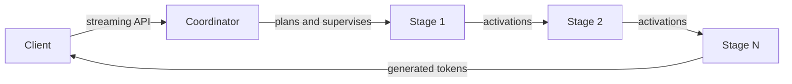

# Mycellios

<p align="center">
  
</p>

<p align="center"><strong>One model. Multiple computers. One inference route.</strong></p>

<p align="center">
  <a href="https://github.com/tych0s/mycellios/actions/workflows/public-quality.yml"></a>
  
  
</p>

Mycellios is an experimental, local-first runtime for serving a language model
across heterogeneous computers. It profiles a model, plans contiguous layer
ranges, supervises each stage and streams activations through a familiar
inference API.

## What it does

- **Plans model stages:** profiles supported models and assigns non-overlapping
  ranges to workers.
- **Runs a supervised route:** coordinates readiness, canaries, registration
  and cleanup, with authenticated remote launch agents.
- **Streams inference:** connects the stages over persistent runtime channels
  and exposes a streaming HTTP API.
- **Captures evidence:** records execution details for debugging, recovery and
  performance evaluation.

## Intended route



Each stage loads its assigned model range. The coordinator manages admission,
planning and route lifecycle; workers execute only authorized launches.

## Current status

The software path has been exercised on one computer, including CPU pipeline
parity, local transport, recovery and cleanup. A route spanning two physical
computers is the next evidence gate. Multi-host throughput, WAN latency, GPU
parallelism across machines and remote recovery have not yet been demonstrated.

Simulation, loopback and multiple processes on one computer are useful for
software checks; they do not count as multi-host evidence. See
[Status and evidence](docs/STATUS_AND_EVIDENCE.md) for the full boundary.

## Economy and token status

The codebase records usage and contribution evidence in an internal ledger,
with signed settlement receipts. Its compute credits are bookkeeping units:
non-monetary, non-transferable and non-withdrawable.

There is no active public token, blockchain network or on-chain contributor
settlement, and no token supply has been chosen. See the [economic and token
status](docs/STATUS_AND_EVIDENCE.md#economic-and-token-status) for the current
readiness gates.

## Try it locally

Requirements: Node.js 24+, npm and Python 3 with the runtime dependencies when
using Python stages.

```bash
npm ci
npm run doctor
npm run demo
```

The demo uses a mock worker on loopback to show the coordinator and API flow. It
does not run inference across computers or provide performance results.

To check a two-host configuration without launching workers:

```bash
npm run preflight:two-host -- --config config/auto-distribute.two-host.example.json --json
```

The example contains placeholder addresses and should report `dryRun: true`.
To configure real machines and attempt the native route, follow the
[Two-host quickstart](docs/TWO_HOST_QUICKSTART.md).

## Contributing

Use Node.js 24 or newer, then run the repository checks:

```bash
npm ci
npm run check
```

See [Development](docs/DEVELOPMENT.md) and [Contributing](CONTRIBUTING.md).

## Documentation

| Topic | Guide |
| --- | --- |
| System design and boundaries | [Architecture](docs/ARCHITECTURE.md) |
| Verified capabilities and evidence | [Status and evidence](docs/STATUS_AND_EVIDENCE.md) |
| First attempt on two physical computers | [Two-host quickstart](docs/TWO_HOST_QUICKSTART.md) |
| Evidence-gated work order | [Roadmap](docs/ROADMAP.md) |
| HTTP API | [OpenAPI contract](docs/openapi.yaml) |
| Security and trust boundaries | [Security](docs/SECURITY.md) |
| Full documentation index | [Documentation map](docs/README.md) |

## License

Mycellios is licensed under [GPL-3.0-only](LICENSE). Third-party notices are in
[THIRD_PARTY.md](THIRD_PARTY.md).
